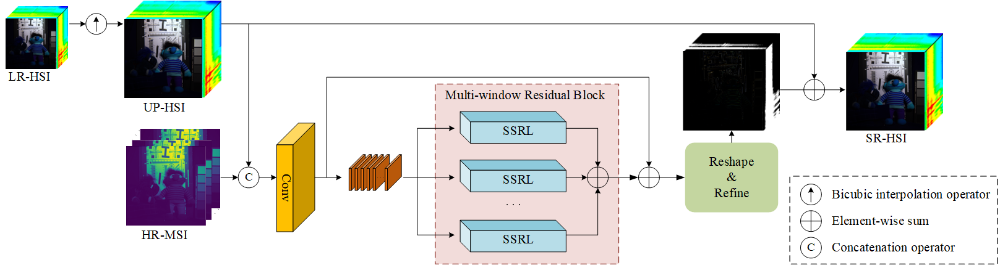
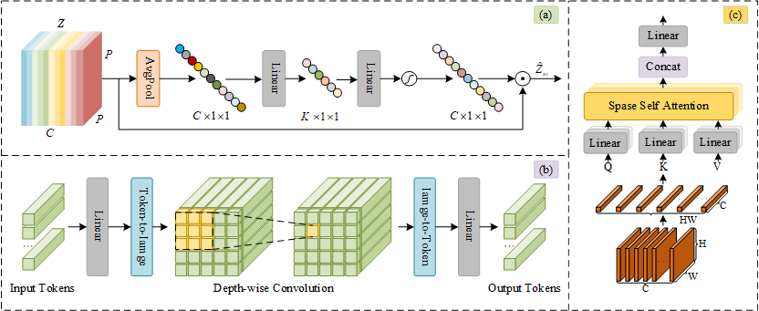

# SEST

## Spectral-Enhanced Sparse Transformer Network for Hyperspectral Super-Resolution Reconstruction(J-STARS2024)

Paper web page: [Spectral-Enhanced Sparse Transformer Network for Hyperspectral Super-Resolution Reconstruction](https://ieeexplore.ieee.org/abstract/document/10675340).



# 

# Abstract:

<p style="text-align: justify;">
    Hyperspectral image (HSI) has garnered increasing attention due to its capacity for capturing extensive spectral information. However, the acquisition of high spatial resolution HSIs is often restricted by current imaging hardware limitations. A cost-effective approach to enhance spatial resolution involves fusing HSIs with high spatial resolution multispectral images collected from the same scene. Traditional convolutional neural network-based models, although gained prominence in HSI super-resolution reconstruction, are typically limited by their small receptive field of the convolutional kernel, primarily emphasizing local information while neglecting nonlocal characteristics of the image. In light of these limitations, this article proposes a novel spectral-enhanced sparse transformer (SEST) network for HSI super-resolution reconstruction. Specifically, the proposed SEST employs a sparse transformer to capture nonlocal spatial similarities efficiently, along with a spectral enhancement module to learn and exploit spectral low-rank characteristics. Integrated within a multiwindow residual block, the abovementioned two components collaboratively extract and combine distinct fine-grained features through a weighted linear fusion process, facilitating the integration of spatial and spectral information to optimize the reconstruction result. Experimental results validate the superior performance of the proposed SEST model against current state-of-the-art methods in both visual and quantitative metrics, thus confirming the effectiveness of the proposed approach.
</p>

# Citations:

If you find the code helpful in your research or work, please cite the following paper:

```
@ARTICLE{10675340,
  author={Yang, Yuchao and Wang, Yulei and Wang, Hongzhou and Zhang, Lifu and Zhao, Enyu and Song, Meiping and Yu, Chunyan},
  journal={IEEE Journal of Selected Topics in Applied Earth Observations and Remote Sensing}, 
  title={Spectral-Enhanced Sparse Transformer Network for Hyperspectral Super-Resolution Reconstruction}, 
  year={2024},
  volume={17},
  number={},
  pages={17278-17291},
  keywords={Transformers;Image reconstruction;Hyperspectral imaging;Superresolution;Feature extraction;Spatial resolution;Amplitude modulation;Hyperspectral image (HSI);multiwindow residual block;nonlocal information;sparse transformer;spectral enhancement;super-resolution},
  doi={10.1109/JSTARS.2024.3457814}}
```

# Requirements：

```
1. Python 3.7.16
2. PyTorch 1.13.1
3. NVIDIA GPU + CUDA
```

# Usage:

```
1. Run train.py for model training
2. Run test.py for super-resolution reconstruc
```

